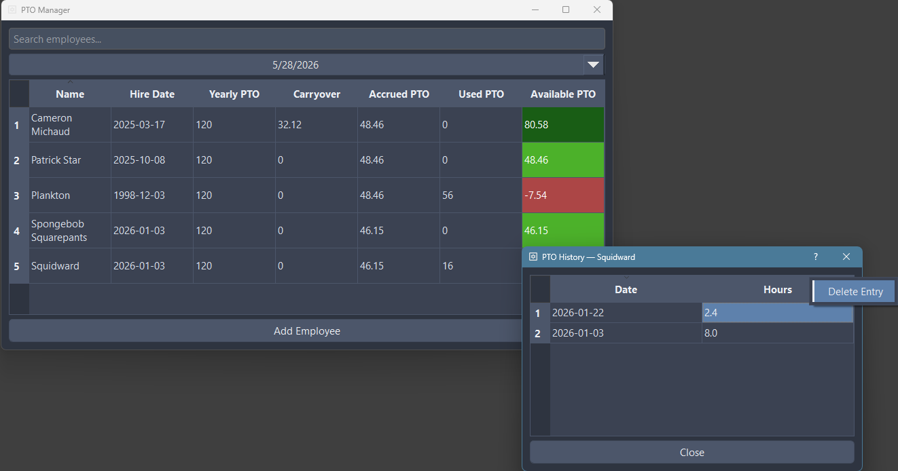

## PTO Management Tool
- See PTO accrual at any date

- View employee PTO history and manage usage

- Edit Records Directly

- Search

- Add Employee

### Importing / Exporting data
- Exporting PTO
  
Exporting PTO will output a CSV for each employee to the assigned directory with format: employee, date, hours

- Importing PTO
  
First create the employees inside of the app and then import any directory containing CSVs formatted as: employee, date, hours - with date being (mm-dd-yyyy) format. If employees are not created prior to the import then a new employee will be created and assigned the PTO according to the name but the hire date and total PTO fields will be 0 and can be edited later.

Note: importing app data from a prior export of app data will carry over both employee information and PTO information.

- Import/Export App Data
  
This will export both the employee and PTO usage tables which can be loaded back into the same program with all data via the import function.
